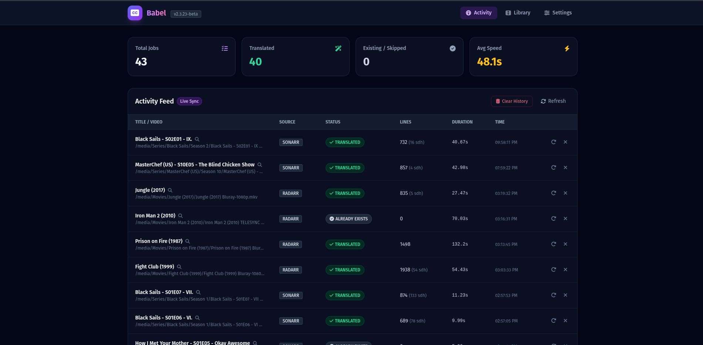
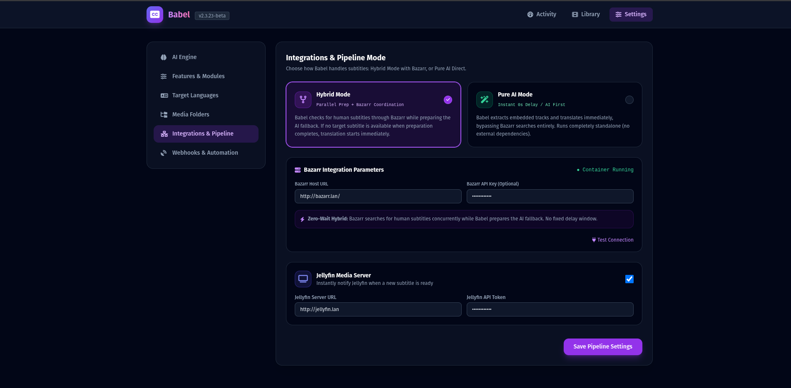
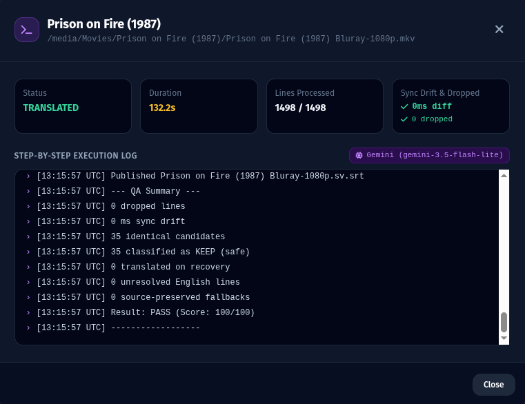

# Babel — Self-Hosted Subtitle Automation

[](https://github.com/hugomossberg/Babel/releases)
[](https://github.com/hugomossberg/Babel/actions/workflows/tests.yml)
[](https://github.com/hugomossberg/Babel/pkgs/container/babel)
[](https://opensource.org/licenses/MIT)

**Babel** is a self-hosted subtitle automation engine built for Sonarr, Radarr, Bazarr, and modern media servers.

It automatically finds the best available subtitle source, translates missing languages using AI, validates output against a multi-tier QA gate, recovers recoverable failures, and publishes subtitles with exact source-to-target timestamp preservation.

> **Install it. Connect your media stack. Forget about subtitles.**

### At a Glance
- **Docker-first:** Recommended Compose setup with Babel + lightweight updater sidecar
- **Automated:** Sonarr & Radarr webhooks
- **Smart Sourcing:** Hybrid Bazarr search + Embedded AI extraction
- **AI Freedom:** Google Gemini, OpenAI, DeepL, or local Ollama models
- **Zero Drift:** 0 ms translation-induced timestamp drift
- **Safe:** Strict QA gate, 0 dropped cues policy, automatic recovery

---

## Screenshots

See Babel in action - from automated Sonarr/Radarr jobs to a fully unattended subtitle pipeline for sourcing, translation, recovery, QA, and publishing.

### Activity Dashboard

Track automated subtitle jobs in real time, including source, status, cue count, and end-to-end processing time.

<p align="center">
  
</p>

### Connect-and-Forget Pipeline

Connect your media stack once and let Babel handle the fallback flow. In Hybrid Mode, Bazarr gets the first chance to find a human-made subtitle while Babel prepares the AI fallback in parallel. If Bazarr succeeds, AI is skipped. If not, Babel continues automatically.

<p align="center">
  
</p>

### Verified Output

Babel does not publish a subtitle simply because an AI provider returned a result. Every completed translation must pass the QA gate first.

This real-world job processed **1,498 / 1,498 cues** with **0 dropped cues**, **0 ms sync drift**, **0 unresolved dialogue**, and a final **PASS score of 100/100**.

<p align="center">
  
</p>


Import -> search -> fallback -> translate -> recover -> QA -> publish

---

## Why Babel?

AI translation models are powerful, but non-deterministic. Without strict validation, language models can:

- Silently skip subtitle lines or entire dialogue blocks
- Leave untranslated source dialogue in the output
- Hallucinate or return malformed subtitle formats
- Misclassify names, sound effects, or speech codes
- Fail temporarily due to provider rate limits or timeouts

Babel treats AI providers as **untrusted components**. Every generated subtitle must pass an automated Quality Assurance gate before it is published to your media library.

> **No valid subtitle → no publish.**

---

## Status: Public Beta

Babel is currently in **Public Beta**. The core pipeline, AI translation engines, and automated recovery loops are actively tested against diverse real-world media libraries.

---

## Features

### Subtitle Resolution & Extraction
- **Embedded Track Extraction:** Extracts embedded text subtitle tracks directly from MKV/MP4 containers with `ffmpeg`/`mkvextract`.
- **Existing Subtitle Protection:** Detects existing target language subtitles and skips redundant translation.
- **Bazarr Coordination:** In Hybrid Mode, checks Bazarr for human subtitles while preparing AI fallback, eliminating fixed delay windows.
- **Source Fallback:** Automatically falls back to external source files (`.en.srt`) or Bazarr-downloaded source tracks if embedded tracks are absent.

### AI Translation Engine
- **Multiple Providers:** Supported backends include:
  - **Google Gemini** (via official SDK, default: `gemini-3.5-flash-lite`)
  - **OpenAI** (e.g., `gpt-4o-mini`, `gpt-4o`)
  - **DeepL** (Free and Pro API)
  - **Ollama / Local Models** (local OpenAI-compatible or Ollama endpoints)
- **Batch Processing:** Processes subtitles in optimal chunks (default: 50 lines) to minimize token overhead and latency while maintaining context.
- **Context-Aware Translation:** Uses dialogue context and optional series-specific glossaries for consistent terminology.

### Multi-Stage Automatic Recovery
- **First-Pass Micro-Repair:** Automatically detects and re-translates missing lines during initial chunk processing.
- **Targeted Dialogue Recovery:** Evaluates unchanged dialogue lines, separating safe invariants (names, entity codes, sound tags) from genuine untranslated speech.
- **Contextual Single-Line Escalation:** Retries stubborn individual lines within their surrounding multi-line dialogue context.
- **Fast Final Rescue:** Batches remaining unresolved lines into a consolidated high-context rescue pass.
- **Deadlock Avoidance:** Prevents infinite recovery loops through strict stagnation detection.

### Source-to-Target Timestamp Preservation
- **0 ms Translation Drift:** Translates subtitles 1:1 cue-by-cue, preserving exact start and end timestamps from the source subtitle file.
- **SDH & Noise Sanitizer:** Conservative pre-processing replaces non-dialogue noise (e.g., `[door closes]`, `♪ music ♪`) with empty formatting tags (`<i></i>`) to maintain subtitle block counts and timing integrity.

### Media Stack Automation
- **Sonarr & Radarr Webhooks:** Automated processing triggered on new media import and upgrade events.
- **Remote Path Mapping:** Built-in path translation for Docker setups with differing host/container mount structures.
- **Jellyfin Notification:** Automatically notifies Jellyfin (`/Library/Refresh`) upon subtitle publication for instant media player availability.
- **Modern Web Dashboard:** Dark-mode management UI with live activity logging, manual file processing, and interactive settings.

---

## Quick Start

Running Babel with Docker Compose requires only a `docker-compose.yml` file. Babel automatically handles inner-container security generation out of the box.

### 1. Create directory and download configuration

The recommended installation uses the comprehensive `docker-compose.yml` from this repository, which includes the One-Click In-App updater.

```bash
mkdir babel && cd babel
curl -O https://raw.githubusercontent.com/hugomossberg/Babel/main/docker-compose.yml
```

2. Edit the file to map your volume paths:
> **IMPORTANT: Volume Paths**
>
> You must map your host paths to Babel's container paths.
> - For TV Shows: Change `/path/to/tv` (with your actual host path). Babel will see this as `/tv` internally.
> - For Movies: Change `/path/to/movies` (with your actual host path). Babel will see this as `/movies` internally.

*(Optional)* **Minimal Installation without Updater:** If you prefer not to use the in-app updater, instead create this minimal `docker-compose.yml` manually:
```yaml
services:
  babel:
    image: ghcr.io/hugomossberg/babel:beta
    container_name: babel
    ports:
      - "8765:8765"
    volumes:
      - ./data:/app/data
      - /path/to/tv:/tv
      - /path/to/movies:/movies
    restart: unless-stopped
    healthcheck:
      test: ["CMD-SHELL", "curl -f http://localhost:8765/health || exit 1"]
      interval: 30s
      timeout: 5s
      retries: 3
      start_period: 10s
```

### 2. Start and Verify

Start the container in the background:

```bash
docker compose up -d
```

Verify that the container is healthy:

```bash
docker compose ps
curl -f http://localhost:8765/health
```

### 3. Open the Web UI

Navigate to `http://YOUR-SERVER-IP:8765` in your browser.

Configure your preferred settings:
1. **AI Provider & Key** (e.g. Gemini, OpenAI, DeepL, or Ollama)
2. **Target Languages** (e.g. Swedish, German, Spanish, etc.)
3. **Media Folders** (`/tv` and `/movies`)
4. **Integrations** (Sonarr, Radarr, Bazarr, Jellyfin)

---

## Updating Babel

### Recommended: One-Click In-App Updates
If you use the recommended Docker Compose setup with `babel-updater`:
- Babel automatically checks for new releases when the web UI is opened and periodically in the background.
- When an update is released, an **Update available** badge appears in the header and Settings.
- Click **Update now** (or review changes in "What's new").
- The updater pulls the latest image, replaces the container, and verifies health.
- If health verification fails, the updater automatically rolls back to the previous working container.

### Manual Fallback
You can also update manually via the terminal at any time:

```bash
docker compose pull
docker compose up -d
```

---

## How It Works

```text
Media imported (Sonarr / Radarr / Manual)
       │
       ▼
Target subtitle already present?
       │
       ├── Yes ──► Validate / Keep existing
       │
       ▼
[Hybrid Mode] Trigger Bazarr search & prepare AI fallback in parallel
       │
       ├─► Fallback Prep (Extract embedded source / SDH sanitize / Validate)
       │
       ▼
Final Target / Bazarr Check (after preparation)
       │
       ├── Found ──► Adopt human subtitle (AI provider calls = 0)
       │
       ▼ (Miss)
AI Translation in batched chunks
       │
       ▼
Multi-Stage Recovery (Micro-repair → Targeted recovery → Context escalation)
       │
       ▼
Quality Assurance Gate
       │
       ├── FAIL ──► Block publication & log diagnostics
       │
       ▼
      PASS / PASS_WITH_WARNINGS
       │
       ▼
Atomic publication (.target.srt) & Media Server Refresh
```

---

## Pipeline Modes

### Hybrid Mode (Recommended for mixed libraries)
Babel checks Bazarr for an existing human subtitle while preparing its AI fallback. This avoids a fixed waiting delay. If no target subtitle is available when preparation is complete, AI translation begins immediately.

### Pure AI Mode
Babel immediately extracts the embedded source track and translates it with AI, bypassing Bazarr searches entirely.

---

## Quality Assurance Policy

Babel validates every subtitle before writing to disk using a three-tier decision model:

| Result | Criteria | Action |
|---|---|---|
| **`PASS`** | 100% of cues translated or verified safe invariants. 0 dropped lines, 0 ms timestamp drift, verified language match. | Published immediately with full confidence. |
| **`PASS_WITH_WARNINGS`** | All timing and structural checks pass. By default, allows at most 3 unresolved dialogue cues AND at most 1% of total cues (configurable). Remaining stubborn cues are preserved as source text to avoid deadlock. | Published cleanly. |
| **`FAIL`** | Structural defect, dropped cue blocks, timestamp corruption, excessive untranslated dialogue, or detected wrong language. | **Blocked.** File is not published. |

> **Timestamp Precision Note:** Babel guarantees **source-to-target timestamp preservation** (zero translation-induced timing drift). It preserves the timing relative to the selected source track. If the source subtitle track itself has pre-existing broadcast timing offsets, Babel preserves those timestamps faithful to the source.

---

## Sonarr & Radarr Integration

Babel can process media automatically upon download or upgrade.

### Sonarr Configuration
1. In Sonarr, navigate to **Settings → Connect → + (Add Webhook)**.
2. Set **URL** to: `http://babel:8765/webhook/sonarr` (or `http://YOUR-SERVER-IP:8765/webhook/sonarr`).
3. Check triggers: **On Download** and **On Upgrade**.

### Radarr Configuration
1. In Radarr, navigate to **Settings → Connect → + (Add Webhook)**.
2. Set **URL** to: `http://babel:8765/webhook/radarr` (or `http://YOUR-SERVER-IP:8765/webhook/radarr`).
3. Check triggers: **On Download** and **On Upgrade**.

### Remote Path Mapping
If Sonarr/Radarr runs in a container with different mount paths than Babel (e.g. Sonarr uses `/data/media/tv` while Babel uses `/tv`), configure Babel's **Remote Path Mapping** in Settings:
- **Remote Path Prefix:** `/data/media/tv`
- **Local Path Prefix:** `/tv`

---

## Bazarr Integration

Babel coordinates with Bazarr's REST API:
- In Settings, enter your **Bazarr Host URL** (e.g. `http://bazarr:6767`) and **API Key**.
- Use **Test Connection** to verify connectivity.

---

## Configuration & Environment Variables

Most configuration is handled in the web interface and stored in `/app/data/babel.db`.

### Environment Variables

Configuration is mostly handled in the web interface and stored in `/app/data/babel.db`. For advanced deployments, you can specify these environment variables in your `.env` file:

| Variable | Default | Description |
|---|---|---|
| `BABEL_PORT` | `8765` | Host port to bind the web server |
| `TZ` | `UTC` | Timezone for logs and scheduling |
| `BABEL_AUTH_USERNAME` | *(empty)* | Optional Basic Auth username for web dashboard |
| `BABEL_AUTH_PASSWORD` | *(empty)* | Optional Basic Auth password for web dashboard |
| `BABEL_WEBHOOK_SECRET` | *(empty)* | Optional secret required on webhook requests (`?secret=...`) |
| `BABEL_UPDATER_SECRET` | *(auto-generated)* | (Optional override) Secret for inner-container auth for updates |
| `TV_PATH` | `/path/to/tv` | Host path mounted to `/tv` inside Babel |
| `MOVIES_PATH` | `/path/to/movies` | Host path mounted to `/movies` inside Babel |

### One-Click In-App Updates Details

Babel supports seamless in-app updates directly from the web dashboard. The repository's `docker-compose.yml` includes the lightweight `babel-updater` sidecar container by default.

- **Automated Discovery:** Babel checks for new releases on web page load and continues checking periodically in the background.
- **Safety & Rollback:** When "Update now" is triggered, the updater pulls the target image, performs container replacement, and verifies container health. If health checks fail, it automatically rolls back to the previous container.
- **Zero-Configuration Security:** The `babel` and `babel-updater` containers automatically generate and share a secure inner-container token on first start. No host ports are exposed on the updater, `docker.sock` is only mounted to the updater, and the token is never exposed to the browser.

*(Optional)* If you prefer to update strictly via `docker compose pull && docker compose up -d`, you can use the minimal `docker-compose.yml` provided in the Quick Start or remove the `babel-updater` service.

### Upgrading an Existing Installation to One-Click Updates

Older single-container installations will not receive `babel-updater` automatically simply by updating the Babel image. To enable One-Click Updates on an existing deployment:

1. **Backup your database first:**
   ```bash
   cp data/babel.db data/babel.db.bak
   ```
2. **Merge the updater configuration into your existing `docker-compose.yml`:**
   Merge the updater definitions from the repository's `docker-compose.yml` without overwriting your custom media mounts or path mappings:
   - Add `babel_updater_auth:/app/auth:ro` under `babel` volumes (read-only).
   - Add the `babel-updater` service with `/var/run/docker.sock:/var/run/docker.sock` and `babel_updater_auth:/app/auth` (read-write).
   - Ensure **no host ports** are exposed on `babel-updater`.
   - Add the named volume `babel_updater_auth:` under the top-level `volumes:` section.
3. **Pull and start:**
   ```bash
   docker compose pull
   docker compose up -d
   ```

---

## Development & Local Builds

For developers wanting to contribute or run from source:

### 1. Clone repository
```bash
git clone https://github.com/hugomossberg/Babel.git
cd Babel
```

### 2. Run tests
```bash
python3 -m venv .venv
source .venv/bin/activate
pip install -r requirements.txt pytest pytest-asyncio
pytest -v
```

### 3. Build Docker image locally
```bash
docker build -t babel:local .
```

---

## Security

- Babel is designed for private local network / self-hosted homelab environments.
- If exposing Babel outside your local network, always place it behind a secure reverse proxy (e.g. Traefik, Caddy, Nginx Proxy Manager) with HTTPS and authentication.
- API keys entered in the UI are stored locally in `data/babel.db` and are masked in frontend responses.

---

## Contributing

Contributions, issues, and feature suggestions are welcome! Please open an issue or pull request on [GitHub](https://github.com/hugomossberg/Babel).

When reporting a bug, please include:
- Babel version (`vX.Y.Z-beta`)
- AI provider and model used
- Relevant anonymized job log
- Expected vs actual behavior

---

## License

This project is licensed under the [MIT License](LICENSE).

**Author:** [Hugo Mossberg](https://github.com/hugomossberg)
